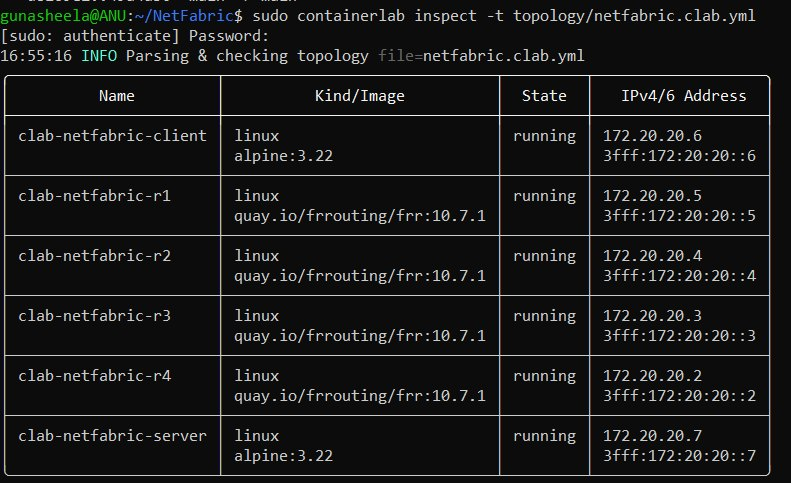
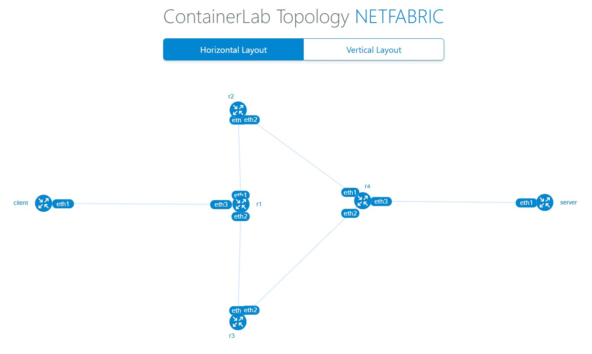
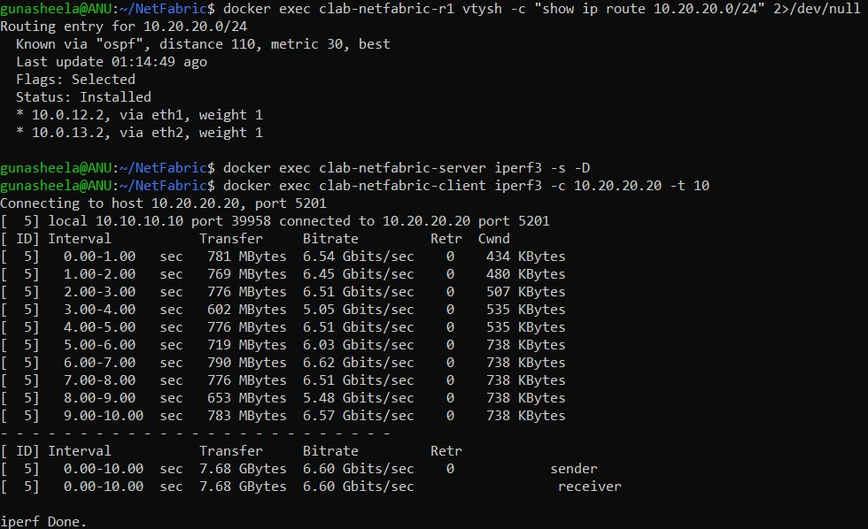
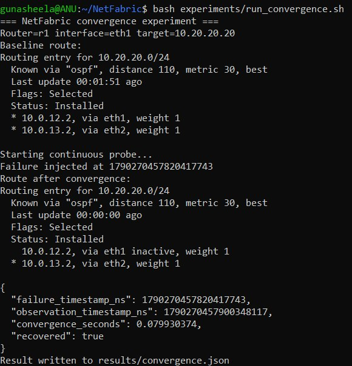

# NetFabric

## Network Engineering & Traffic Intelligence Lab

NetFabric is a reproducible virtual network lab for studying **routing, traffic behaviour, telemetry and network resilience**.

It runs a routed topology with FRRouting, generates measurable traffic, collects network evidence, stores experiment history, and exposes the observations through a FastAPI service and operations console.

**Core story:** build the network → configure routing → generate traffic → measure behaviour → introduce failure → observe recovery → preserve evidence.

### Technical focus

- Linux/container networking
- IPv4 subnetting and routed segments
- FRRouting and OSPF
- Route and next-hop inspection
- ICMP and iperf3 measurements
- Latency, packet loss and throughput analysis
- PCAP capture and protocol analysis
- Persistent experiment history
- Controlled link-failure testing
- Route convergence observation
- Python/FastAPI automation
- Automated testing and CI

## Architecture

```text
Traffic endpoints
       │
       ▼
   ┌───────┐
   │  R1   │
   │  FRR  │
   └──┬─┬──┘
      │ │
   ┌──▼─┐ ┌▼───┐
   │ R2 │ │ R3 │   redundant paths
   │FRR │ │FRR │
   └─┬──┘ └──┬─┘
      │      │
      └──┬───┘
         ▼
      ┌─────┐
      │ R4  │
      │ FRR │
      └──┬──┘
         │
      Endpoint

        │ observations
        ▼
 Telemetry → Analytics → SQLite → FastAPI → Operations Console
```

## Lab Evidence

The screenshots below are captured from the working Containerlab/FRRouting environment and show the project from deployment through routing, traffic measurement and failure recovery.

### 1. Lab deployment

All six lab nodes are running: four FRRouting routers plus client and server endpoints.



### 2. Redundant routed topology

The topology contains two routed paths between R1 and R4: **R1 → R2 → R4** and **R1 → R3 → R4**.



### 3. Routing and traffic evidence

The combined evidence view shows OSPF installing two equal-cost next hops toward `10.20.20.0/24` and a real 10-second TCP measurement of **7.68 GBytes at 6.60 Gbit/s with 0 retransmissions**.



### 4. Controlled failure and convergence

A controlled R1 `eth1` failure removes one path while OSPF retains the redundant R1 → R3 → R4 path. The recorded run converged in **0.07993 seconds (~79.9 ms)** and recovered successfully.



> These are local virtual-lab measurements, not production-network benchmarks. Results depend on the host, container runtime, topology and routing timers.

## Quick start

Run the Python tests:

```bash
pip install -r requirements.txt
pytest -q
```

For the complete network lab, follow **[docs/lab.md](docs/lab.md)**.

Start the API:

```bash
uvicorn api.main:app --reload
```

Serve the console:

```bash
python -m http.server 8080 --directory dashboard
```

## Signature experiment

NetFabric includes a controlled link-failure experiment using redundant routed paths.

The experiment records:

1. failure injection
2. route-state change
3. alternate-path selection
4. traffic recovery
5. convergence timing
6. before/after evidence

Run:

```bash
./experiments/run_convergence.sh
```

The resulting artifacts are written under `results/`.

## API

| Endpoint | Purpose |
|---|---|
| `GET /health` | service health |
| `POST /api/v1/routes/inspect` | inspect route state |
| `POST /api/v1/measurements/ping` | run and persist ICMP measurement |
| `POST /api/v1/measurements` | store a measurement |
| `GET /api/v1/measurements` | retrieve evidence |
| `GET /api/v1/analytics/series` | retrieve time-series data |
| `GET /api/v1/analytics/experiments` | compare experiments |
| `POST /api/v1/analytics/pcap` | analyze a PCAP |

## Engineering principles

**Network first.** The network and routing layer own state; the dashboard only presents it.

**Evidence over claims.** Measurements carry timestamps, experiment IDs, units and sources.

**Reproducibility over screenshots.** The project is designed to be run, measured and repeated.

**No artificial AI layer.** Machine learning is not included simply as a portfolio keyword.

## Validation

Before presenting the project, use **[docs/validation.md](docs/validation.md)**.

Measured experiment observations belong in **[docs/results.md](docs/results.md)**. The repository deliberately does not publish fabricated performance numbers.

## Repository structure

```text
topology/       virtual network definition
routing/        FRR configuration
telemetry/      measurements and route inspection
traffic/        traffic scenarios
analytics/      metric, path and PCAP analysis
storage/        experiment history
api/            FastAPI service
dashboard/      operations console
experiments/    controlled failure experiments
tests/          automated tests
docs/           lab, validation and engineering notes
scripts/        operational helpers
```

## Limitations

NetFabric is a reproducible virtual lab, not a production network. Results depend on the host, container runtime, topology and routing timers.

Local measurements must not be interpreted as production-network benchmarks.

## License

MIT
